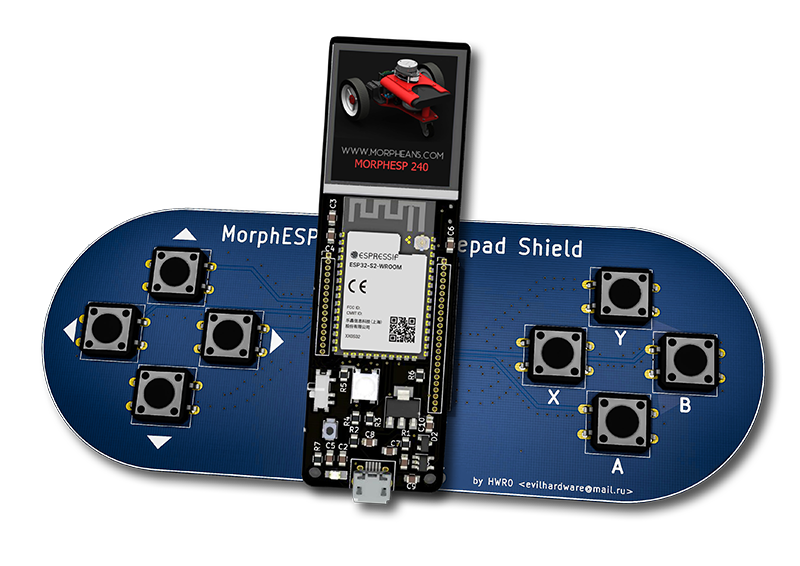

# MorphESP240 Shields
Here I will publish finished and "Work-in Progress" Shields Designs for the MorphESP 240 by [@ccadic](https://github.com/ccadic).
The MorphESP 240 is actually campaigning [here on Crowdsupply](https://www.crowdsupply.com/morpheans/morphesp-240) . He, as a creator, and we all as Backers are also counting on your support !

  

### - [Gamepad Shield](https://github.com/hwreverse/MorphESP240_Shields/tree/main/mesp240_gamepadshield) (complete)

- 2x4 Button Gamepad Shield and connection to optional Buzzer ready to be fabricated and assembled by the PCBA service of your choice. It can also be soldered by hand as I used only 0805 and SOT-23 footprints for the passives and the transistor (on the backside).  Pushbuttons are classic, comfy 12mm x 12mm x 4.3/5mm units, that won't use that much your fingertips. 
- Gerber files and archive are available too. I included alsoa BOM and a CPL file in the main Directory in the [JLCPCB](https://jlcpcb.com/) Format for PCBA (PCB Assembly)

)

### - [Gamepad Shield 3D](https://github.com/hwreverse/MorphESP240_Shields/tree/main/mesp240_3Dpad) (complete)

- Next evolution of the Gamepad Shield in a new design with two additional analog josticks and a I2C Gyroscope + Accelerometer integrated circuit for Position & Inertia capture. 
- 2x4 Button Gamepad Shield and connection to optional Buzzer ready to be fabricated and assembled by the PCBA service of your choice. It can also be soldered by hand as I used only 0805 and SOT-23 footprints for the passives and the transistor (on the backside).  Pushbuttons are classic, comfy 12mm x 12mm x 4.3/5mm units, that won't use that much your fingertips. 
- Gerber files and archive are available too. 

)

### - [Da Bomb Shield (Draft - unfinished)](https://github.com/hwreverse/MorphESP240_Shields/tree/main/da_bomb_breadboard)

- If the project is great, then the Prototyping Shield must be surely...

**- Da Bomb!**

*... in the early design stage ...*

### - [MorphESP 240 to Sharp PC-G850* Shield](https://github.com/hwreverse/MorphESP240_Shields/tree/main/morphesp240_g850_interface) (complete)

- This shield offers an interface with bidirectiional level shifting form the 11pin Interface of Sharp Vintage Pocket Computers of the PC-G850 Series. (and any other Sharp with a 11pin Connector) 
- This Project is ready to be fabricated, a zip of the Gerber files is included.. As usual, I included alsoa BOM and a CPL file in the main Directory in the [JLCPCB](https://jlcpcb.com/) Format for PCBA (PCB Assembly), so you don't have to solder those pesky 0402 Resistors and capacitors 
 For more Pocketcomputer hardware see my other repositories [here](https://hwreverse.github.io/)

